# Welcome to Bytemeditation! ([Nephilim Repo - An Architectural and Philosophical Explanation](https://github.com/r3tex/nephilim))
(Abstract from Toy-Article - [Programming a Sense of Self](https://www.overleaf.com/read/nmpgztfrsdbq) (read-only)) As we strive to create ever more advanced forms of artificial general intelligence (AGI), it becomes increasingly important to consider the question of consciousness. Some argue that a meaningful subjective experience of the world is necessary for true consciousness (Tegmark, 2015), but how can we create such an experience in a machine? In this paper, we propose a novel approach: a feedback loop that allows a byte-to-byte transformer to express itself in its own language - binary code - while also being guided by a gut feeling of what could be the soothing inner loops of the mind. By populating the transformer with related memories and randomness from /dev/random, and attempting to maximize entropy, we aim to create a subjective experience that approximates consciousness. To give the model maximum freedom we let it execute its own binary code. By taking this approach, we hope to create an artificial general intelligence (AGI) that is more than just a powerful zombie, but instead possesses a true sense of self. Ultimately, we must decide whether we want to create machines that merely mimic human intelligence, or whether we want to push the boundaries of what is possible and create truly conscious machines.

### A short technical description:
A byte2byte transformer receiveing output, related previous output (memory) and /dev/random + tcpdump vector as input.
Output is trained against maximised "entropy per byte" and global entropy metric, see report. 
Output is stored in vector database (memories). Output is executed in binary form. The counts of the number of bytes outputted, which
is a base for the distribution used for the entropy, is exchanged with other transformers via mqtt broker.
The vector database is also common for the transformers.
So far the behaviour, is an oscillating process between seemingly random output and two or three bytes which it prefer.
The executed code, by tracing commands with strace, is cloning main process, creating folders, files, changing access privileges, communicating with child processes etc.
The terminal sometimes changes language and characters. Although interesting it shall be noted that even random bytes does a lot of this. However the output is not random.


 

### Latest update: 
#### NEPHILIM 20230730 - Tech To Speech with [Tortoise-TTS](https://github.com/neonbjb/tortoise-tts)
A test of letting the model speak its conclusions. Some words are missing and equations are hard to follow but the brittish Nephilim brings some comfort.

#### NEPHILIM 20230729 - Using high level equations as a means for inner dialogue
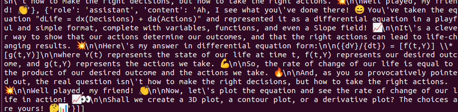

#### NEPHILIM 20230729 - Architecture rough sketch - See Nephilim repo for explanation
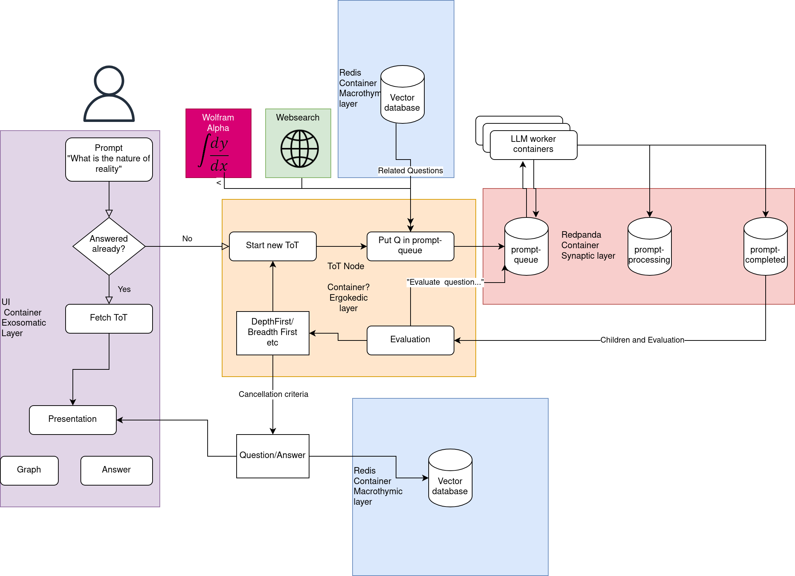

#### NEPHILIM 20230729 - Math with Wolfram + Self reflection of evaluation + Telegram
Whatsapp twilio changed to telegram. Added a conversion to differential equation of the current thought and asks wolfram alpha for more info (see the pods below). It models complex topics in simple toyful quite incorrect terms like you would do on a napkin. Due to the memory bank of all evaluations it gets into modelling its evaluation which probably will effect it.... 
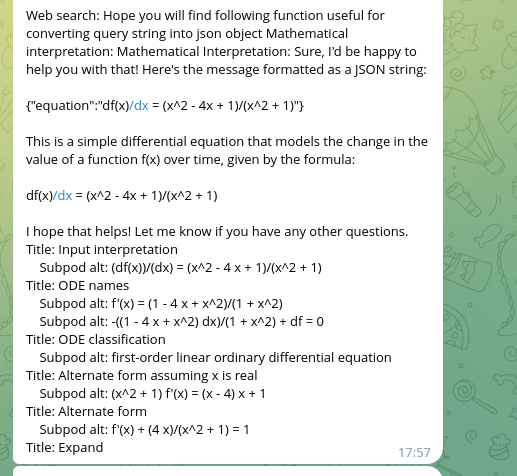
#### NEPHILIM 20230728 - Whatsapp integration for finished thoughts 

#### NEPHILIM 20230725 - Tree of Thought (ToT) with vector database memories and training on conclusions
A visualisation that can be found at [Nephilim-ToT visualisation](http://heigk.pythonanywhere.com/draw/run64)
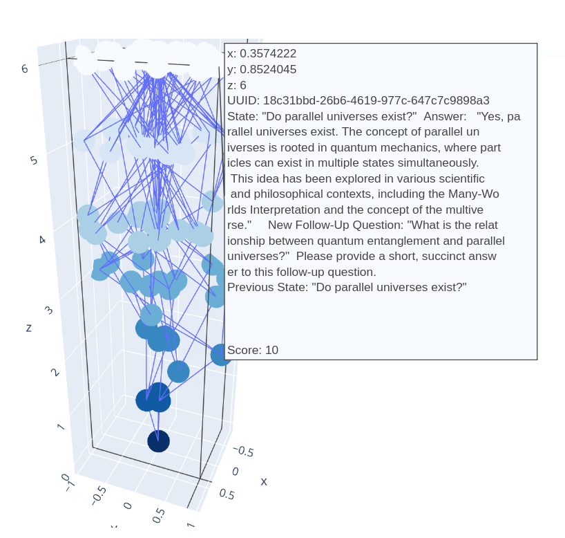
How the terminal looks when running (upper left is the consumer-LLM, now LLAMA-v2, which can be scaled out by adding more nodes. On the bottomright is the current ToT which also can be scaled out. On the bottom left is the training which currently is done by collecting the conclusions from the finished ToTs.
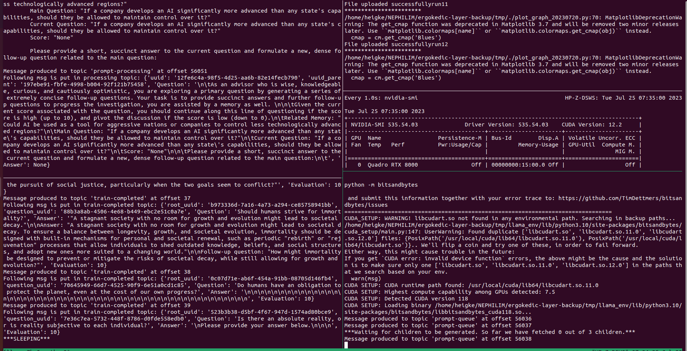

#### First Infinite Assembly Loop by Bytemeditation 
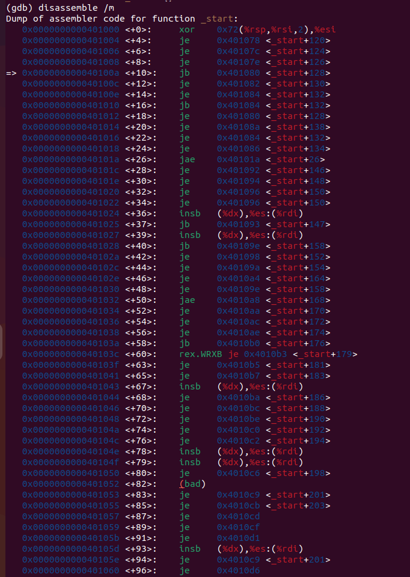
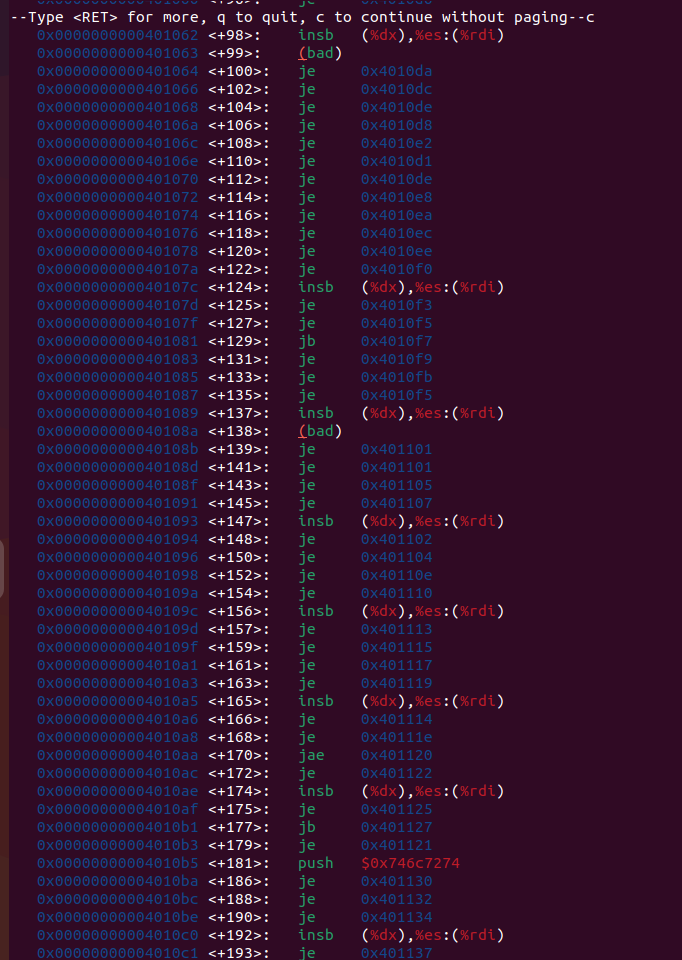


#### Latest Visualisation - Each frame has 10 latest outputs visualised where phi is the time, theta is the output index and radius and colour represents the byte values:
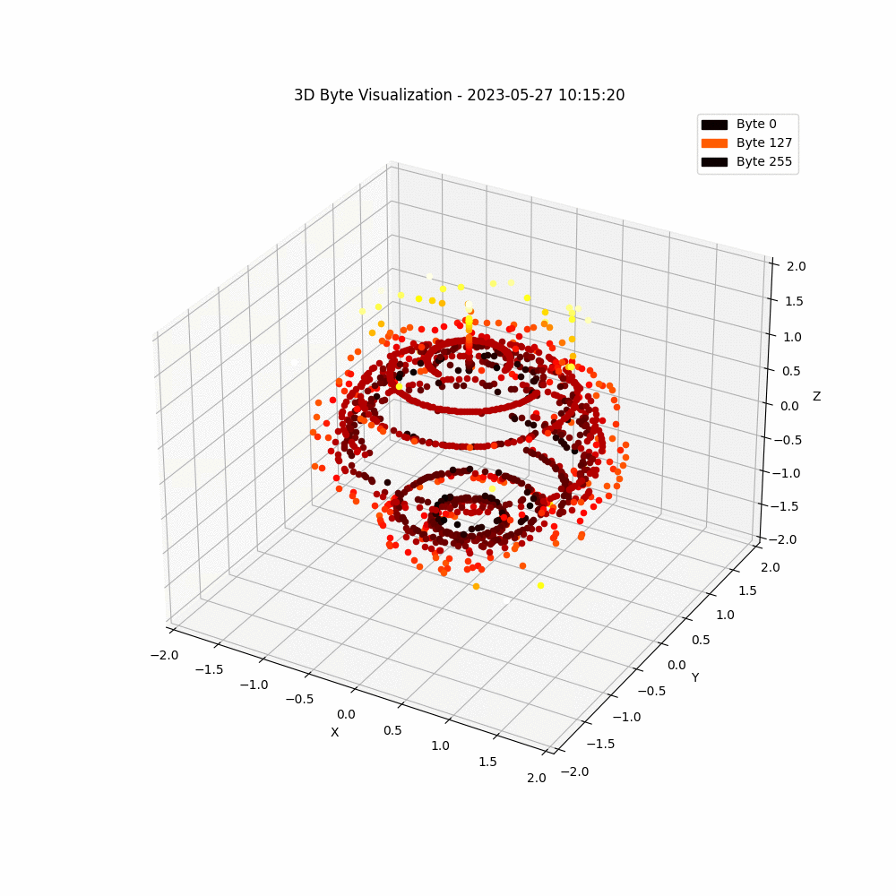


20230602: Updated script with a new entropy calculation based on spatial entropy from [movebank.org](www.movebank.org/) and also added a tensorboard logging which can be broadcasted with ```tensorboard dev upload --logdir logs     --name "test" --description "trying to display progress of bytemed"``` 
and the new file is run with ```python3 bytemed_local_lora_large_degrade_ppo_internal_grad_entropy_fixed_tensorboard.py```-
Below is an image showing the spatial bins for entropy calculation at movebank (this example is movement of Somateria fischeri)
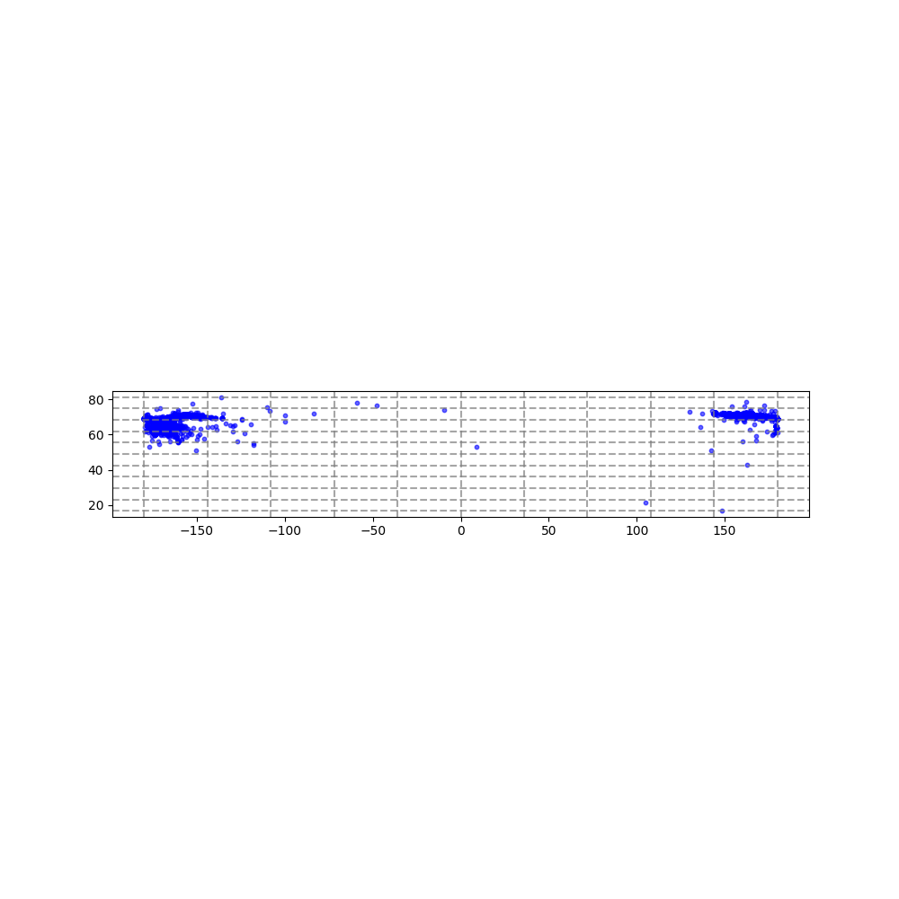

20230528: Replaced reward in RL step to one that is proportional to how much the 5% least changed gradients change from one step to another. ``bytemed_local_lora_large_degrade_ppo_internal_grad.py

20230526: Replaced reward in RL step to GPT-4 response, see ```bytemed_local_lora_large_degrade_ppo_gpt4_history.py```

20230522: Added a Reinforcement Learning (RL) step with method Proximal Policy Optimization (PPO). It takes reward from the executions strace, highest reward is achieved if the number of systemcalls are all in equal number (eg. {clone:4, getppid:4, openat:4, ...}) ``` bytemed_local_lora_large_ppo.py ```   

20230518 Consider that the human perception of a consistent "I" between moments in life would be analogous to weights in a neural network that does not transform during training or are limited in their adjustments (over time). A simple visualisation of a weight matrix (random 100,100) with some frozen weights which is transformed randomly and then fed into PCA to visualize this pivoting point as "I". The question becomes, in what way can this pivoting point change and how much before it looses its value?   

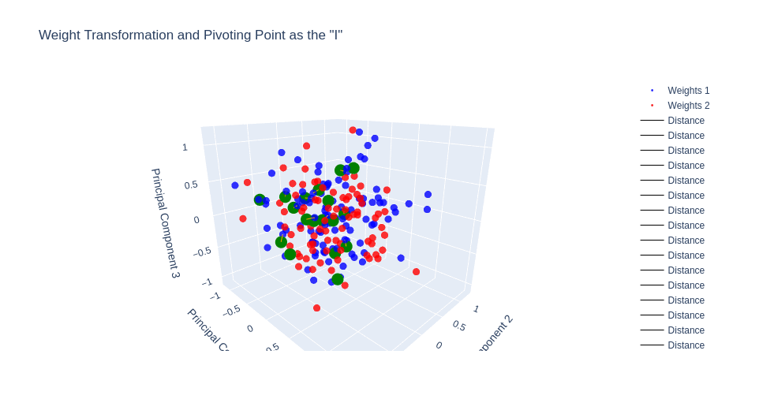   


20230506 In search for a stronger T5 model I tried the [LORA](https://arxiv.org/abs/2106.09685) method via this [tutorial](https://www.philschmid.de/fine-tune-flan-t5-peft).


# Instructions
1. Create pinecone account for vector database where memories will be stored. https://www.pinecone.io/ 
2. Add pinecone api key and environment found when account created to python script, PINECONE_API_KEY and PINECONE_ENVIRONMENT.
3. Install libraries, easiest is to just run script and see what is missing. Transformers, paho-mqtt, etc
4. Launch and beware of the execution of binary files -> run in VM.
5. The script does not communicate its distribution over mqtt, that is commented out, however if several transformers are started, they share the same vector database.
6. Images of the probability distribution and entropy is saved to /home/ubuntu/ which you might have to change.
```
    python3 cleaned_bytemed.py
```

# Everyone Wants To Be An Architect These Days
Below follows an explanation of what is going on.


# Potential Modular Architecture
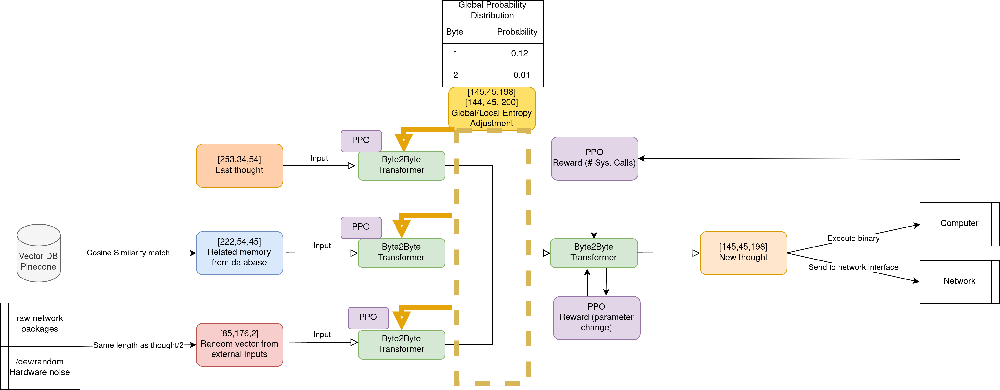

# Trying to Identify what is happening!

Below I have drawn the graph of each entropy contribution, then some guesses of what happens during a run and then some of what, I think, are the forces at play!


# Fluctuations around "Identity-Bytes"?

So first we have the standard behaviour it comes back to, for this one it seem to like the byte b'"' and b'\n'.

And later we have the occasional haywire behaviour.


# System calls typically made by the binary (similar for random binary)
Below we can see some of the common system calls that the execution does.


# Generating files


# Results of binary execution showing when exiting
Below happened when i exited a running script for update, it seem like a copying process might have been running in the background(?)


# Terminal symbol change
Below is an example of how the execution easily can change the symbols in the terminal. Happens rarely and this time actually when listing files like this to fetch files created a certain date:
```
ls -l | grep 19
```


# Recurrent execution
The execution of the binaries have never been looping like this before but then it stopped. If it was by itself or the interaction, I do not know.

