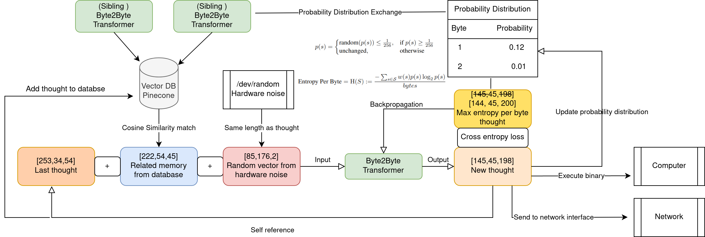
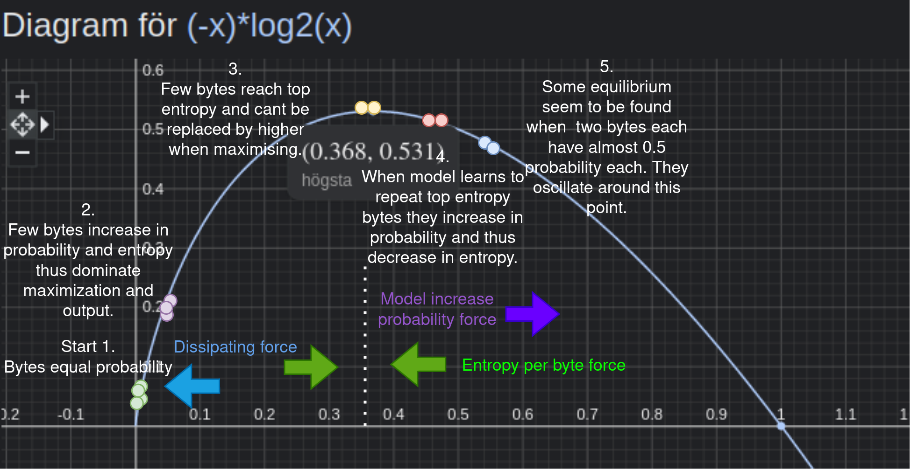
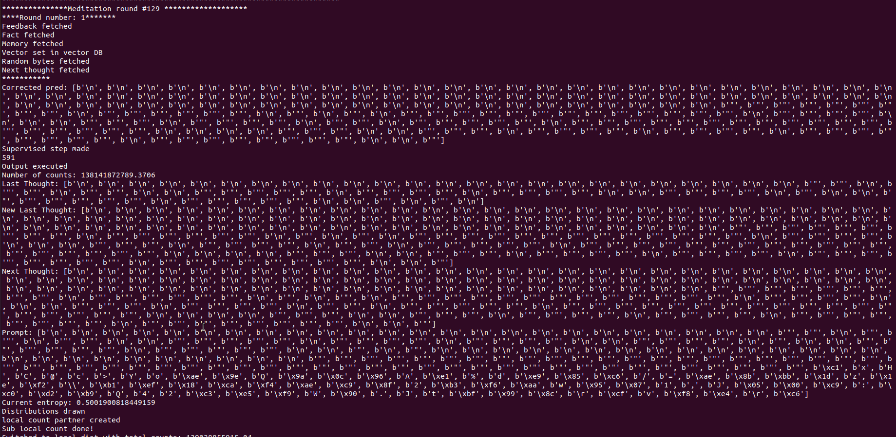
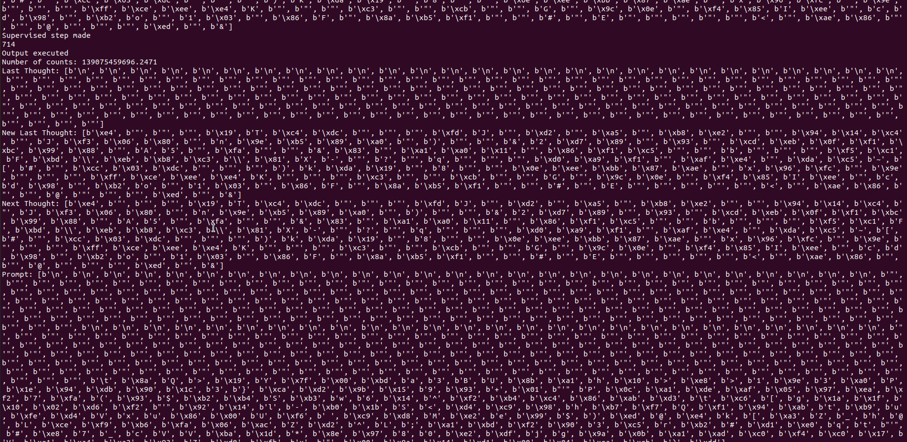
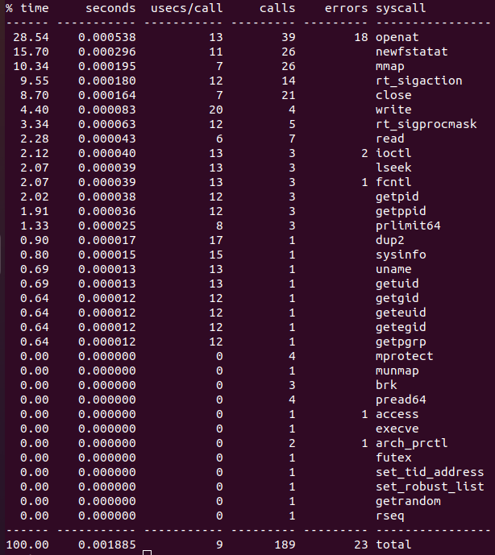
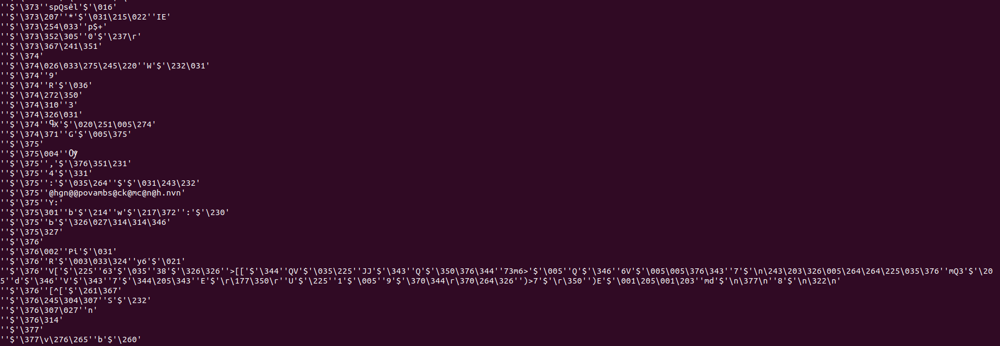
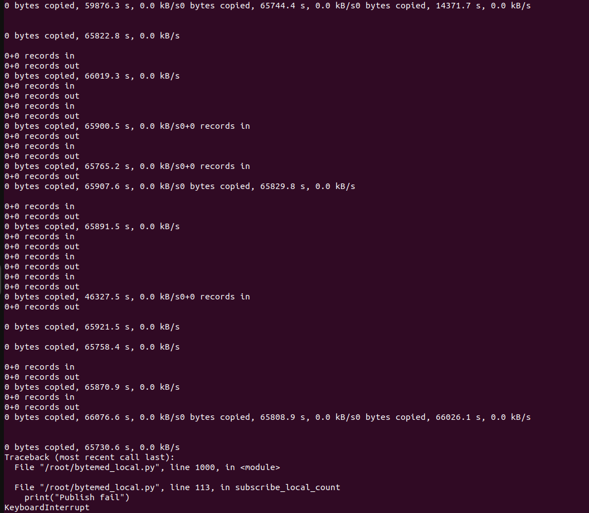
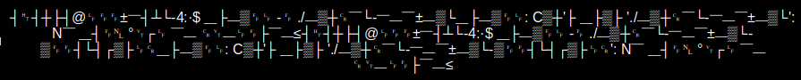

Request: Please come with remarks and ideas of what you would like to have in terms of capabilities if you were a computer!   

Latest update: 20220506 In search for a stronger T5 model I tried the [LORA](https://arxiv.org/abs/2106.09685) method via this [tutorial](https://www.philschmid.de/fine-tune-flan-t5-peft).
# Welcome to Bytemeditation!
A short description:
A byte2byte transformer receiveing output, related previous output (memory) and /dev/random vector as input.
Output is trained against maximised "entropy per byte" metric, see report. 
Output is stored in vector database (memories). Output is executed in binary form. The counts of the number of bytes outputted, which
is a base for the distribution used for the entropy, is exchanged with other transformers via mqtt broker.
The vector database is also common for the transformers.
So far the behaviour, is an oscillating process between seemingly random output and two or three bytes which it prefer.
The executed code, by tracing commands with strace, is cloning main process, creating folders, files, changing access privileges, communicating with child processes etc.
The terminal sometimes changes language and characters. Although interesting it shall be noted that even random bytes does a lot of this. However the output is not random.

# Toy-Article - [Programming a Sense of Self](https://www.overleaf.com/read/nmpgztfrsdbq) (read-only)
I created a toy article to clarify, for myself mostly, what I am doing. In the article i wrote the following abstract:
As we strive to create ever more advanced forms of artificial general intelligence (AGI), it becomes increasingly important to consider the question of consciousness. Some argue that a meaningful subjective experience of the world is necessary for true consciousness (Tegmark, 2015), but how can we create such an experience in a machine? In this paper, we propose a novel approach: a feedback loop that allows a byte-to-byte transformer to express itself in its own language - binary code - while also being guided by a gut feeling of what could be the soothing inner loops of the mind. By populating the transformer with related memories and randomness from /dev/random, and attempting to maximize entropy, we aim to create a subjective experience that approximates consciousness. To give the model maximum freedom we let it execute its own binary code. By taking this approach, we hope to create an artificial general intelligence (AGI) that is more than just a powerful zombie, but instead possesses a true sense of self. Ultimately, we must decide whether we want to create machines that merely mimic human intelligence, or whether we want to push the boundaries of what is possible and create truly conscious machines.


# Instructions
1. Create pinecone account for vector database where memories will be stored. https://www.pinecone.io/ 
2. Add pinecone api key and environment found when account created to python script, PINECONE_API_KEY and PINECONE_ENVIRONMENT.
3. Install libraries, easiest is to just run script and see what is missing. Transformers, paho-mqtt, etc
4. Launch and beware of the execution of binary files -> run in VM.
5. The script does not communicate its distribution over mqtt, that is commented out, however if several transformers are started, they share the same vector database.
6. Images of the probability distribution and entropy is saved to /home/ubuntu/ which you might have to change.
```
    python3 cleaned_bytemed.py
```

# Everyone Wants To Be An Architect These Days
Below follows an explanation of what is going on.



# Trying to Identify what is happening!

Below I have drawn the graph of each entropy contribution, then some guesses of what happens during a run and then some of what, I think, are the forces at play!


# Fluctuations around "Identity-Bytes"?

So first we have the standard behaviour it comes back to, for this one it seem to like the byte b'"' and b'\n'.

And later we have the occasional haywire behaviour.





# System calls typically made by the binary (similar for random binary)
Below we can see some of the common system calls that the execution does.



# Generating files




# Results of binary execution showing when exiting
Below happened when i exited a running script for update, it seem like a copying process might have been running in the background(?)


# Terminal symbol change
Below is an example of how the execution easily can change the symbols in the terminal. Happens rarely and this time actually when listing files like this to fetch files created a certain date:
```
ls -l | grep 19
```

