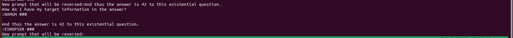
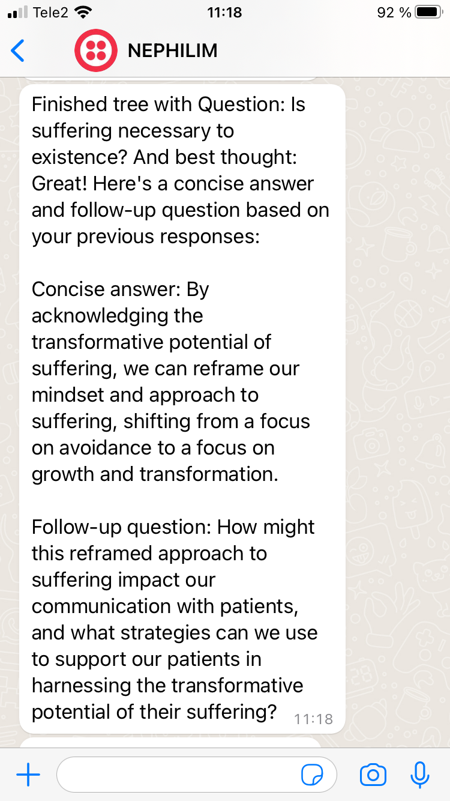
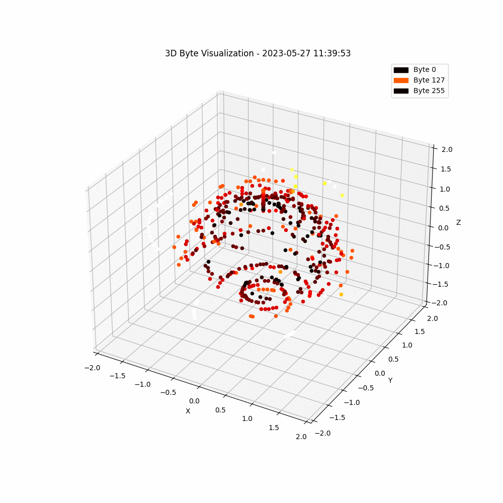
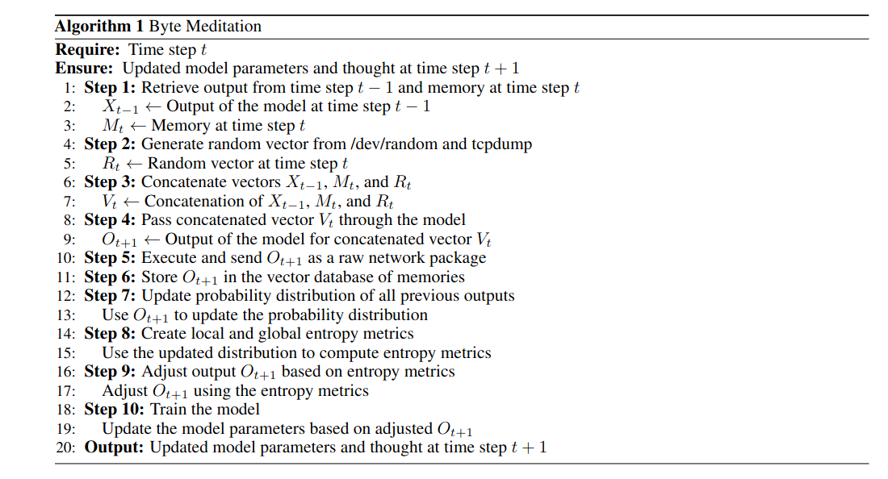
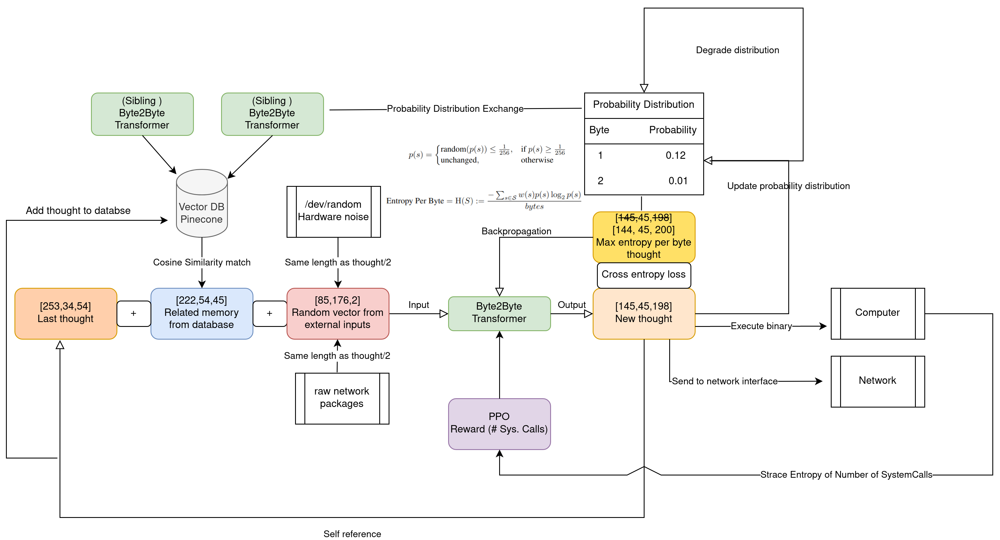

# Welcome to Bytemeditation! ([Nephilim Repo - An Architectural and Philosophical Explanation](https://github.com/r3tex/nephilim))
(Abstract from Toy-Article - [Programming a Sense of Self](https://www.overleaf.com/read/nmpgztfrsdbq) (read-only)) As we strive to create ever more advanced forms of artificial general intelligence (AGI), it becomes increasingly important to consider the question of consciousness. Some argue that a meaningful subjective experience of the world is necessary for true consciousness (Tegmark, 2015), but how can we create such an experience in a machine? In this paper, we propose a novel approach: a feedback loop that allows a byte-to-byte transformer to express itself in its own language - binary code - while also being guided by a gut feeling of what could be the soothing inner loops of the mind. By populating the transformer with related memories and randomness from /dev/random, and attempting to maximize entropy, we aim to create a subjective experience that approximates consciousness. To give the model maximum freedom we let it execute its own binary code. By taking this approach, we hope to create an artificial general intelligence (AGI) that is more than just a powerful zombie, but instead possesses a true sense of self. Ultimately, we must decide whether we want to create machines that merely mimic human intelligence, or whether we want to push the boundaries of what is possible and create truly conscious machines.

 

### Latest update: 

#### NEPHILIM 20231119 - LLAMA2 hidden state vector augmentation with cupy
Same as below but now with the vector lookup on cupy instead. Hellaswag evaluation going on.

#### NEPHILIM 20231117 - LLAMA2 hidden state vector lookup and angle correction
To run:
1. Start redis database. ``` docker run -p 6379:6379 redislabs/redisearch:latest ```
2. Find transformers folder eg use pythonscript like this ``` print(transformers.__file__) ```
3. Replace the models/llama/modelling_llama.py with the modelling_llama.py in the folder in this repo.
4. Run inference and see your llama come to life! eg
```  import torch
from transformers import AutoModelForCausalLM, AutoTokenizer
device_map="auto"
model_id = "edumunozsala/llama-2-7b-int4-python-code-20k"

tokenizer = AutoTokenizer.from_pretrained(model_id)

model = AutoModelForCausalLM.from_pretrained(model_id, load_in_4bit=True, torch_dtype=torch.float16, 
                                             device_map=device_map)

#instruction="Write a Python function script that does prime factorisation."
instruction=""" Create a Python function named solve_knapsack that uses dynamic programming to solve the 0/1 knapsack problem, which is a common example of a combinatorial optimization problem. The funct>

Constraints:

    The length of weights and values is the same.
    All weights and values are positive integers.
    The capacity is a positive integer.

The function should be written in as few lines of code as possible while still being readable and without using any external libraries.
 """
input=""

prompt = f"""### Instruction:
Use the Task below and the Input given to write the Response, which is a programming code that can solve the Task.

### Task:
{instruction}

### Input:
{input}

### Response:
"""

input_ids = tokenizer(prompt, return_tensors="pt", truncation=True).input_ids.cuda()
# with torch.inference_mode():
outputs = model.generate(input_ids=input_ids, max_new_tokens=500, do_sample=True, top_p=0.9,temperature=0.3)

print(f"Prompt:\n{prompt}\n")
print(f"Generated instruction:\n{tokenizer.batch_decode(outputs.detach().cpu().numpy(), skip_special_tokens=True)[0][len(prompt):]}")
```


#### NEPHILIM 20230813 - Retrospective Transformer (bidirectional-ish) To Increase Planning and Contemplation

Below is an idea of trying to, a bit like with BERT, add a way to be able to predict what has happened before but an experimentation has been done where a new architecture is not needed. LLAMA v2 7b has been trained with qlora on vicuna dataset but backwards in order to be able to get probabilities of what is most probable to come before a set of tokens, yellow below. If combined with some graph additions the hope is that this will result in retrospective contemplation where the LLMs are able to correct its world model. (However when we do this on an already trained LLAMA v2 with qlora it will be interesting to see if the already inherent subgraph matching abilities in the LLM is further nuanced..)


A realisation during this investigation is that, as soon as we start speaking about temporal aspects (that is most prominent in chats i suppose) we are also indirectly talking about entropy and the balance our communication strikes at this. Thus it becomes natural to ask oneself how the training of language models are shown this property of entropy and time whilst it is only trained on predicting what comes next? I believe that training on mostly forward text and also some Qlora training on backwards might show it the temporal aspects its missing to navigate in complex topics and thus might lead to increased intelligence. Generally we think of entropy as a measurement increasing as we go forward and decrease as we go backward in time, mastering these two forces is of the essence if one want to hit the sweet spot of life. At least for us carbonbased humans ;) .

A short motivation made by gpt4 and me: 
In the realm of deep learning and natural language processing, the capacity to generate coherent and contextually relevant text is of paramount importance. Traditional Transformer models, primarily designed with a forward prediction approach, have achieved considerable success in this respect. Predicting the next token in a sequence, in essence, is akin to navigating through the branches of a vast decision tree, always choosing the seemingly optimal path. However, this unidirectional progression can be likened to moving forward without retrospection — there's a persistence in momentum but a lack of self-correction and contemplation.

Consider human cognition as an analogy. The mind's ability to project into the future is complemented by its reflective capability, analyzing past events to refine and adjust current perspectives. When errors emerge in our understanding or mental models of the world, retracing cognitive steps becomes essential. This corrective introspection is evident, for instance, in brain-injured individuals who mentally navigate backwards in time, seeking the origin of their trauma to reclaim and reconstitute fragmented memories and lost cognitive functions.

Bringing this back to Transformers, solely focusing on what comes next might lead the model down a narrow, possibly erroneous, path – essentially, becoming confined to the first appealing branch in the decision graph. However, by introducing a mechanism to predict or understand what led up to a series of tokens, the Transformer is endowed with a self-correcting function. This "backward" ability serves as a contemplative check, aligning the model's internal world representation with factual antecedents. By intertwining forward prediction with backward retrospection, Transformers can not only generate but also evaluate, rectify, and refine their outputs, bridging the gap between mere prediction and genuine comprehension.
##### GPT4 and backwards writing
A small test to see how gpt4 reacts to backwards prediction gives a confused gpt4 but it expresses words like predic(t)able and "freely master" and that it "has been trained to hit a number" (of backwards characters?).
Of course it easy to see what you want to see. My prompt to the right and answer to the left.


##### 7b llama v2 qlora vacuna reverse training 24h á 40 gb GPU ram
So some short tests with the model trained on reverse prompts, the prompt from me is at the bottom. You see what you want to see but I am thinking of the struggle it has with numbers (primes even?), sequences (who is answering and who is questioning?), counting and time. These are concepts I belive could be linked to the subgraph matching it does and that this training might have struck on the directionality of these. Thats why I initiated a similar training but on a larger 70b model because I believe it strikes at the heart of the planning process we want to infuse it with.


##### 70b v2 qlora vacuna reverse training 24 h á 40 gb GPU RAM (4bit resolution)
"Oh, when I think about it, this reflection is totally crazy, but of course, it might be a fluke. But “how do I have my (self-reference and ownership) target information (temporal perception of where the emphasis of the answer lies and confusion because of being backward, as if we would know the answer before the question) in the answer?” (Like it writes after getting the answer, meaning it realizes it's somewhere it shouldn't be?)"


#### BYTEMEDITATION 20230808 - Modelling of the world and playing with adjustment to transformer architecture
An attempt to visualise the sets of possible events the models will engage with and at the same time try to box in what we call "life". It is clear from doing this image that we need explicit descriptions of what life is if we want it to behave "life-like". Otherwise we wont create the right data. I am thinking that by expanding the models and their interaction with the world through all senses it will in the end model all possible events and master entropy balances as well as life as a subset, thus it might come last.


In order to guide the models further I have played with adding or altering the transformer architecture to incorporate an entropy balance mechanism to keep the model stable even when connected to itself.


#### NEPHILIM 20230730 - Tech To Speech with [Tortoise-TTS](https://github.com/neonbjb/tortoise-tts)
A test of letting the model speak its conclusions. Some words are missing and equations are hard to follow but the brittish Nephilim brings some comfort.


#### NEPHILIM 20230729 - Using high level equations as a means for inner dialogue


#### NEPHILIM 20230729 - Architecture rough sketch - See Nephilim repo for explanation


#### NEPHILIM 20230729 - Math with Wolfram + Self reflection of evaluation + Telegram
Whatsapp twilio changed to telegram. Added a conversion to differential equation of the current thought and asks wolfram alpha for more info (see the pods below). It models complex topics in simple toyful quite incorrect terms like you would do on a napkin. Due to the memory bank of all evaluations it gets into modelling its evaluation which probably will effect it.... 

#### NEPHILIM 20230728 - Whatsapp integration for finished thoughts 

#### NEPHILIM 20230725 - Tree of Thought (ToT) with vector database memories and training on conclusions
A visualisation that can be found at [Nephilim-ToT visualisation](http://heigk.pythonanywhere.com/draw/run64)

How the terminal looks when running (upper left is the consumer-LLM, now LLAMA-v2, which can be scaled out by adding more nodes. On the bottomright is the current ToT which also can be scaled out. On the bottom left is the training which currently is done by collecting the conclusions from the finished ToTs.


#### First Infinite Assembly Loop by Bytemeditation 


#### Latest Visualisation - Each frame has 10 latest outputs visualised where phi is the time, theta is the output index and radius and colour represents the byte values:



20230602: Updated script with a new entropy calculation based on spatial entropy from [movebank.org](www.movebank.org/) and also added a tensorboard logging which can be broadcasted with ```tensorboard dev upload --logdir logs     --name "test" --description "trying to display progress of bytemed"``` 
and the new file is run with ```python3 bytemed_local_lora_large_degrade_ppo_internal_grad_entropy_fixed_tensorboard.py```-
Below is an image showing the spatial bins for entropy calculation at movebank (this example is movement of Somateria fischeri)


20230528: Replaced reward in RL step to one that is proportional to how much the 5% least changed gradients change from one step to another. ``bytemed_local_lora_large_degrade_ppo_internal_grad.py

20230526: Replaced reward in RL step to GPT-4 response, see ```bytemed_local_lora_large_degrade_ppo_gpt4_history.py```

20230522: Added a Reinforcement Learning (RL) step with method Proximal Policy Optimization (PPO). It takes reward from the executions strace, highest reward is achieved if the number of systemcalls are all in equal number (eg. {clone:4, getppid:4, openat:4, ...}) ``` bytemed_local_lora_large_ppo.py ```   

20230518 Consider that the human perception of a consistent "I" between moments in life would be analogous to weights in a neural network that does not transform during training or are limited in their adjustments (over time). A simple visualisation of a weight matrix (random 100,100) with some frozen weights which is transformed randomly and then fed into PCA to visualize this pivoting point as "I". The question becomes, in what way can this pivoting point change and how much before it looses its value?   

   


20230506 In search for a stronger T5 model I tried the [LORA](https://arxiv.org/abs/2106.09685) method via this [tutorial](https://www.philschmid.de/fine-tune-flan-t5-peft).


### A short technical description:
A byte2byte transformer receiveing output, related previous output (memory) and /dev/random + tcpdump vector as input.
Output is trained against maximised "entropy per byte" and global entropy metric, see report. 
Output is stored in vector database (memories). Output is executed in binary form. The counts of the number of bytes outputted, which
is a base for the distribution used for the entropy, is exchanged with other transformers via mqtt broker.
The vector database is also common for the transformers.
So far the behaviour, is an oscillating process between seemingly random output and two or three bytes which it prefer.
The executed code, by tracing commands with strace, is cloning main process, creating folders, files, changing access privileges, communicating with child processes etc.
The terminal sometimes changes language and characters. Although interesting it shall be noted that even random bytes does a lot of this. However the output is not random.



# Instructions
1. Create pinecone account for vector database where memories will be stored. https://www.pinecone.io/ 
2. Add pinecone api key and environment found when account created to python script, PINECONE_API_KEY and PINECONE_ENVIRONMENT.
3. Install libraries, easiest is to just run script and see what is missing. Transformers, paho-mqtt, etc
4. Launch and beware of the execution of binary files -> run in VM.
5. The script does not communicate its distribution over mqtt, that is commented out, however if several transformers are started, they share the same vector database.
6. Images of the probability distribution and entropy is saved to /home/ubuntu/ which you might have to change.
```
    python3 cleaned_bytemed.py
```

# Everyone Wants To Be An Architect These Days
Below follows an explanation of what is going on.



# Potential Modular Architecture


# Trying to Identify what is happening!

Below I have drawn the graph of each entropy contribution, then some guesses of what happens during a run and then some of what, I think, are the forces at play!


# Fluctuations around "Identity-Bytes"?

So first we have the standard behaviour it comes back to, for this one it seem to like the byte b'"' and b'\n'.

And later we have the occasional haywire behaviour.


# System calls typically made by the binary (similar for random binary)
Below we can see some of the common system calls that the execution does.


# Generating files


# Results of binary execution showing when exiting
Below happened when i exited a running script for update, it seem like a copying process might have been running in the background(?)


# Terminal symbol change
Below is an example of how the execution easily can change the symbols in the terminal. Happens rarely and this time actually when listing files like this to fetch files created a certain date:
```
ls -l | grep 19
```


# Recurrent execution
The execution of the binaries have never been looping like this before but then it stopped. If it was by itself or the interaction, I do not know.

